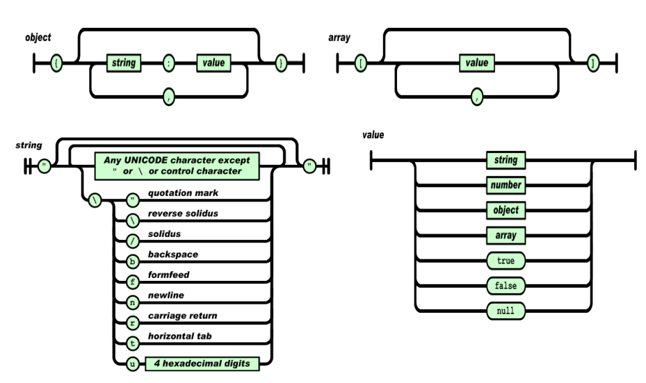
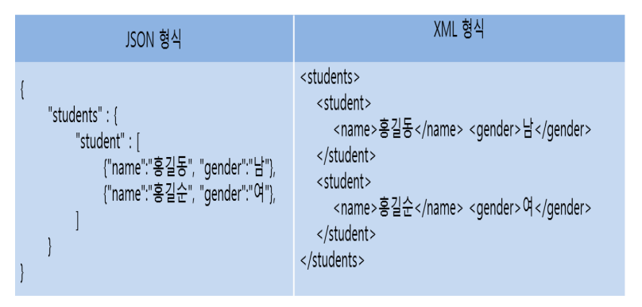
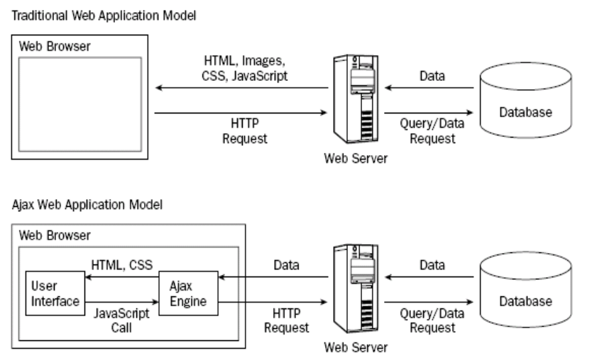

eclipse -webproject - edu

imsi.html

http://localhost:8000/edu/imsi.html

[^edu/imsi.html]: URI

  --> URL 문자열


```html
<form action="..." method="">
	<input type ="text" placeholder = "이름을 입력하세요///" required name= "gname">
	<input type="submit" value="전송">
</form>
```

[http://localhost:8000/edu/htmlexam/...?gname=%EC%96%BC%ED%8B%B0%EB%B0%8B](http://localhost:8000/edu/htmlexam/...?gname=얼티밋)

​																		-----------------------Query String ---------------------------


Query String  : 

- WebClient 가 Web server에게 정보(페이지)를 요청할 때 함께 전달 가능한 name과 value 구성 되는 문자열

- W3C가 정해 놓기를

  ---> Query String Encoding 규칙

  1. name = value 로 구성되어야 한다.
  2. 여러개의 name=value를 전달하는 경우에는 &기호로 분리한다
  3. 영문과 숫자 그리고 일부 특수 문자를 제외하고는 %기호와 코드 값으로 전달된다.
  4. 공백은 +기호로 전달된다


radio.나 check box는 value 값이 필수임.


## CSS

전역적인 스타일 설정

- \<head>태그 안에 \<style> 태그를 사용한다.

- css정의 방법

  ```css
  css 선택자 {
  	css 속성명 : 속성값;
      css 속성명 : 속성값;
      css 속성명 : 속성값;
      css 속성명 : 속성값;
  }
  ```

### CSS 선택자

- 전체 선택자
- 태그 선택자
- class선택자
- id 선택자
- 자식 선택자
- 자손 선택자
- 첫번째 동생 선택자
- 모든 동생 선택자


- CSS를 다르게 적용하려는 태그들 또는 태그의 컨텐트에 정의하는 용도의 태그들
  - \<div> - 여러 태그들을 묶거나 또는 태그에 대하여 CSS를 적용하고 싶을때.
  - <span> 


## JavaScript의 DOM 객체

- 각자 위치를 객체로 만든다.
- 즉, HTML객체, 그 하위의 객체 HEAD, BODY객체 그 하위의 TITLE 객체 등등 같이 각자 모든 요소를 트리구조의 객체로 만들고, javascript로 사용한다.


- img[src]
- img[src=duke.png]
- img[src=$png] 
  - png로 끝나는 모든 것을 지정한다


display : none , block, inline,inline-block


### 구문

1. javascript 코드 작성 방법
   1. 오로지 구문만 있으면 된다. main 이런거 필요없다.
2. 데이터 타입과 변수선언
   1. 숫자, 문자열타입, 논리타입, 객체타입(배열타입), undefined 타입

```javascript
var 변수명;
var 변수명 =초기값;
   var v1;
   v1=10 // number
   v1='10' //String
   v1= true; // boolean
      -----------------------> typeof 연산자가 필요
```

3. 연산자(java와 85% 비슷)   ----> ==, ===, !=, !==, && ,||, delete, typeof...
4. 제어문 : for foreach, while, do ~ while, break, continue
5. 함수의 정의와 활용 
   1. 생성자 함수로 정의 및 생성
   2. 객체 리터럴로 정의 및 생성
6. 예외처리
   1. 예외처리는 가능하면 하지 말자, 비용이 많이듬
7. API
   1. 표준 API: 함수, 생성자 함수
   2. BOM API 
      1. HTML5 API 
         - canvas API - 캔버스용도로 주로 씌으는  API
         - webstorage - 브라우저가 정해져있는 규격에 폴더에 저장함. 웹에 맡기지 않아도 된다.


### 삽입 위치

- JavaScript 코드는 가급적\<body> 태그의 마지막 부분 즉,\</body> 태그의 바로 위에 삽입한다.
  
- 자바 스크립트 코드가 도는 동안 HTML 코드가 정지 되기 때문에 , 자바 스크립트 코드의 처리 시간은 오래 걸리기 때문에 먼저 HTML부터 출력하고 자바 스크립트 코드를 처리한다.
  
- for…in 반복문 사용이 가능하다(for-each 문이라고도 핚다.)

  ```javascript
  
  ```

NaN의 약어 Not a number : 연산할 수 없는 상황이 아니면 Nan출력

불리언 형도 숫자로 간주 : true면 1 false면 0


`비교식1 && 비교식2`

`비교식1 || 비교식2`

- &&와  ||를 이용해서 if문 대신해서 구현 가능

```javascript
if(a>b)
    window.alert(a);

//---------> 같은 출력
a>b && window.alert(a);
a<=b && window.alert(a);
```


```javascript
window.alert()	// 경고메세지를 출력 하는 서브창을 디스플레이 
    			//-> 서브창을 클릭 안하면 아무것도 안됨
window.prompt()	// 사용으로부터 데이터를 입력받는 서브창을 디스플레이
window.confrim()	//확인받는 목적으로 사용되는 API로서
					//Yes/no형식으로 데이터를 입력받는 서브창을 디스플레이
```


### 배열

1. 다양한 타입의 데이터를 하나의 배열에 구성 가능
2. 배열 생성 후에도 크기 변경 가능


- 생성

```js
//리터럴을 이용해 생성
var a1 = [];
var a2 = [10,20,30];
var a3 = [true,'가나다',100];

a1.length
a2.length
a3.length
a3[1]
// API를 이용해 생성
var a4 = new Array();
var a5 = new Array(10);		//10이라는 배열의 크기 지정, int형 매개변수가 1개일 경우에 한해
var a6 = new Array(10,20);	// 배열을 생성해 10,20을 넣어라
var a7 = new Array(true,3.5,'aaa','aa');
```


```js
var fruits = [10,3,6,20,7];
document.getElementById("demo").innerHTML = fruits;

function myFunction() {
  fruits.sort();
  document.getElementById("demo").innerHTML = fruits;
}
//10,20,3,6,7 이 출력된다. 문자열을 기본으로 생각하기 때문에 '10','20' 같이 생각하기 때문 

//방법
var fruits = [10,3,6,20,7];
document.getElementById("demo").innerHTML = fruits;

function myFunction() {
  fruits.sort(function(a, b){return a-b});
  document.getElementById("demo").innerHTML = fruits;
}
//3,6,7,10,20

//역순
var fruits = [10,3,6,20,7];
document.getElementById("demo").innerHTML = fruits;

function myFunction() {
  fruits.sort(function(a, b){return b-a});
  document.getElementById("demo").innerHTML = fruits;
}
//20,10,7,6,3
```


```js
for(var i in a1)  // for(int data : ary)
	document.write("<h4>"+ a1[i] +"</h4>");
//for each 문은 undefined 아닌 값만 뽑는다. undefined 인 부분은 그냥 넘어간다.
```


## 함수와 매서드

- 함수 : 수행 문장을 담고 있는 호출 가능 모듈, 단독으로 호출 가능
- 매서드 : 수행문장들을 담고 있는 호출 가능 모듈, 객체를 통해서만 호출 가능, 객체 멤버 정의 되는 함수
- 전역코드 : scrpit 수행 문장들


### 선언적(명시적) 함수 정의

```js
function 함수이름([매개변수]) {
    ....
}
```


### 리터럴(표현식) 함수 정의

```js
function([매개변수]) {
    
}(아규먼트);
// 즉시 실행 되는 함수이다.
함수명([아규먼트]);
```


함수는 리턴 값이 없더라도 무조건 undefined가 출력된다


``` js
	var obj ={
			name : "듀크",
			eat : function(food) {
				writeColor(this.name + "가 " + food + "를 먹어요!!","h3","green");
			}
	}
	obj.eat("바나나");
	obj.eat("딸기");

	hr();
	
	writeColor(typeof obj,'h2',"red");
	obj.project = "자바 스크립트";
	obj.study = function() {
		writeColor(this.name + "가 " + obj.project + "를 동부해요!!","h3","magenta");
	}
	obj.study();

	hr();
	
	for(var key in obj)
		write(key + ":" + obj[key],"h4");

	hr();

	write(obj.project,"h4");
	write(obj["project"],"h4");
```

자바 스크립트는 같은 멤버 안에 있는 인스턴스 접근할때 무조건 this를 붙혀야 한다.

객체가 이미 선언 한 다음에 인스턴스를 추가하는게 가능하다.

이런식으로 일반 객체도 전부 뽑아 내는게 가능하다.

키 값을 직접 줘서 접근도 가능하다.


### prototype

- 생성자 함수만 사용이 가능하다.

``` js
function Student(name, sub1, sub2, sub3)
 this.name = name;
 this.sub1 = sub1;
 this.sub2 = sub2;
 this.sub3 = sub3;
}
Student.prototype.getName = function() {
 return this.name;
}
Student.prototype.geSum = function() {
 return this.sub1+this.sub2+this.sub3;
}
Student.prototype.getAvg = function() {
 this.getSum() / 3;
}
```

- student 안에 매서드를 선언한다면 각각 객체마다 매서드 영역이 할당 되지만, prototype을 사용한다면 하나의 매서드만 선언되고 모두가 공유하게 된다. static과 조금은 비슷하다고 생각하면 된다.


### BOM

- window,document,location(다른 웹 페이지로 이동 가능한 기능), history(뒤로가고 앞으로 가고, 브라우저 방문 후 정볼르 담고 있다.), navigator(브라우저 정보를 추출), screen

#### 꼭 기억해야 되는 명령어

- location.href : 페이지 이동을 구현하고자 할 때
- location.reload() : 새로고침을 요청한다.


- navigator.userAgent


```html
<body>
<form name="fm">
	<select id="choice" onchange="go();">
        <!-- onchange는 change 이벤트가 발생하면 ""안의 함수를 실행시켜라-->
		<option value="">---관심있는 기술을 선택해 주세요---</option>
		<option value="http://www.w3schools.com/js/default.asp">Learn JavaScript</option>
		<option value="http://www.w3schools.com/js/js_htmldom.asp">
            											Learn HTML DOM</option>
		<option value="http://www.w3schools.com/jquery/default.asp">Learn jQuery</option>
		<option value="http://www.w3schools.com/xml/ajax_intro.asp">Learn AJAX</option>
		<option value="http://www.w3schools.com/js/js_json_intro.asp">Learn JSON</option>
	</select>
</form>
<script>
function go(){	
    //옵션으로 선택된 주소의 값을 추출해서 location.href에 넣는다.
    //location.href 주소를 이동하는 bom 명령어
    
	//location.href = document.getElementById("choice").value;
    // document.getElementById 의 ()안의 아이디 즉 # 값을 얻어온다
	location.href = document.querySelector("#choice").value;
    // document.querySelector() ()안의  제공한 선택자 또는 선택자 뭉치와 일치하는 문서 내 첫 번째 Element를 반환합니다. 일치하는 요소가 없으면 null을 반환합니다.
	//location.href = "http://www.naver.com/";
}
</script>
</body>
```


```html
<script>
	write(navigator.platform, "h3");
    // 디바이스 대한 정보를 얻어온다. 예를들면 몇 비트 컴퓨터인지.
    // ex ) Win16, Win32, Win64, MacIntel ,Mac
	write(navigator.userAgent, "h3");
    // 이 페이지를 랜더링 하고 있는 클라이언트 머신과 브라우저 정보를 하나의 문자열로 추출
	var str = navigator.userAgent;
	if (str.match(/(ipad)|(iphone)|(ipod)|(android)|(webos)/i))
        // /.../i 사이 안에 하나라도 맞는거라도 있으면 확인한다.
		write("모바일 디바이스 이군요", "h2");
	else
		write("모바일 디바이스가 아니군요", "h2");
</script>
```


```html
<script>
	//변수를 선언합니다.
	var child = window.open('/edu/first.html', '', 'width=300, height=200');
    //팝업 창을 띄우는 것을 차일드로 크기를 300, 200으로 정한다.
	var width = screen.width;
	var height = screen.height;
    // 높이와 너비를 전체화면으로 설정 
	child.moveTo(0, 0);	
	child.resizeTo(width, height);
    //0,0 위치에 설정해둔 높이와 너비로 출력 즉, 전체 화면
	window.setInterval(function () {
	    child.resizeBy(-20, -20);
	    child.moveBy(10, 10);
	}, 2000);  
    //window.setInterval로 2000미리초 즉 2초마다 함수를 실행, 차일드의 크기를 20씩 줄고 현재 위치에서 10,10을 더한 위치로 움직인다.
</script>
```


### DOM(Document Object Model)

- 브라우저의 HTML 파서가 서버로부터 전달받은 HTML 문서의 내용을 파싱하고 랜더링할 때 인식된 HTML 태그, 속성 그리고 텍스트로 구성된 컨텐츠를 하나하나 javaScript 객체로 생성한다. 이 때 만들어진 DOM객체들(Element 객체, Text객체) 부모자식 관계를 유지해서 트리 구조를 형성한다.

  --> javaScript 코드로 HTML 태그나 속성 그리고 컨텐츠를 읽거나 변경할 수 있게 지원해서 동적인 웹페이지를 생성


1. 필요한 태그를 찾는 방법

   - document.getElementsByTagName("태그명") : NodeList

   - document.getElementById("태그id속성의값") : Node

   - document.getElementsByClassName("태그의Class속성값") : NodeList

     

   - document.querySelector("CSS선택자") : Node

   - document.querySelectAll("CSS선택자")  : NodeList

     - 1번, 3번 5번 같은 경우는 복수의 리턴을 한다.

2. 태그의 내용이나 속성을 읽고 변경하는 방법, 삭제하는 방법

   - 찾은 Element객체.innerHTML
   - 찾은 Element객체.textContent
   - 찾은 Element객체.getAttribute("속성명")
   - 찾은 Element객체.setAttribute("속성명",속성값)
   - 찾은 Element객체.removeAttribute("속성명")
   - 찾은 Element객체.속성명
   - 찾은 Element객체.속성명 - 속성값

3. 태그에서 발생하는 이벤트 또는 브라우저 객체서 발생하는 이벤트(window)에 대한 이벤 핸들러 구현방법

   1. 인라인 이벤트 모델

      - \<button onclick="코드">1\</button>

   2. 전역적 이벤트 모델(고전 이벤트 모델)

      - \<button>2\</button>

        ```js
        var dom = document.getElementsTagName("button")[0];
        dom.onclick = function() { 
        	//코드 
        };
        dom.onclick = null;
       // 한번만 실행 하고 전역 이벤트를 삭제하고 싶을때
        ```

   3. 표준 이벤트 모델

      - \<button>\</button>
   
        ```js
        var dom = document.getElementsTagName("button")[0];
        dom.addEventLisner("click",function() {
            //코드
       });
        dom.removeEventListner("click",function() { 
	//코드
        })
       // 한번만 실행 하고 전역 이벤트를 삭제하고 싶을때
        ```
        
      


#### 이벤트

- 이벤트 

  - 웹 페이지 상에서 마우스, 키보드 등을 통해 발생하는 액션
  - 웹 브라우저에서 자동으로 발생하는 액션

- 이벤트 핸들러(리스터)

  - 이벤트가 발생했을 때 수행되는 기능을 구현한 함수

- 이벤트 타겟

  - 이벤트가 발생한 대상 DOM 객체

  - 이벤트 타겟을 정하는 방법

    1. this

    2. 핸들러에 매개변수(e)를 하나 정의한 후 : e.target

       -> 매개변수에 이벤트 객체를 전달

- data - XXX : id를 정할 수 없을때 임의로 정한 데이터들
  
  - data-라고 붙어 있으면 -가 붙어 있어서 .으로 추출 불가능 getAttribute 로 뽑아내야 한다.


#### Default 이벤트 핸들러

- HTML 태그에 디폴트로 등록있는 이벤트 핸들러를 의미한다.
- 태그에 따라서는 눈에 띄는 디폴트 이벤트 핸들러 가지고 있다.
- \<a> click 이벤트에 대한 핸들러를 내장하고 있다.
- \<form> : submit 이벤트에 대한 핸들러를 내장하고 있다.


```html
<a href = "http://java.sum.com/">...</a>
<a href = "test.html">...</a>
<a href = "#memo">...</a>
<!-- 같은 페이지 내의 id = memo의 위치로 움직인다.-->
<a href = "test.html#subject">...</a>
<!-- 다른 페이지로 움직이고 subject가 가장 상단에 위치하는 위지로 이동-->
```


#### 이벤트 버블링

- 특정 DOM객체에서 이벤트가 발생하면 그 DOM 객체에 등록된 이벤트 핸들러만 수행되는 것이 아니라 조상 DOM객체에 등록된 핸들러도 수행된다.


### Canvas API

#### 웹 페이지에 그린을 그릯 수 있도록 지원하는 HTML5 API 이다.
- \<canvas> 엘리먼트를 사용하여 그린을 그리기 위핚 영역을 정의하고 스크릱트로 그린을 그릮다.
- 직선, 박스, 원, 베지에 곡선 등 다양핚 그린을 직접 그릯 수 있으며 원하는 사이즈 그리고 칼라의 이미지 출력을 처리핛 수 있다.
- \<canvas> 엘리먼트 작성 방법 : 그린을 그릯 수 있는 사각형 영역이 만들어 진다

```html
<canvas id= "draw" width= "400" height= "300"></canvas>
```


```js
var area = document.getElementById("draw");
var ctx = area.getContext("2d");
ctx.fillStyle = "rgb(255,0,0)";
ctx.fillRect (10, 10, 100, 100);
//x,y,width,height - 10 10 위치에서 가로 너비가 100 100 인 사각형을 그린다.


arc(x, y, r, startAngle, endAngle, anticlockwise)
// (x,y)에서 시작하여 반시계방향 , 3시 방향이 0도이다.
// (anticlockwise)으로 반지름(r)릶큼의 원을 그릮다.

quardraticCurveTo(cp1x, cp1y, x, y)
//핚 개의 조젃점(cp1x,cp1y)을 이용해 (x,y)까지의 곡선을 그릮다
bezierCurveTo(cp1x, cp1y, cp2x, cp2y, x, y) 
//두 개의 조젃점(cp1x,cp1y)와 (cp2x,cp2y)를 이용해 (x,y)까지의 곡선을 그릮다
```


#### 그라디언트와 패턴

```js
createLinearGradient(x1, y1, x2, y2)
//시작저과 끝점을 정함. 이 값을 어떻게 주는냐에 따라 대각성 그라디언트 세로 그라디언트 등등이 정한다.
```


#### 스타일

- 스타일 영역이 아닌 자바 스크립트 영역에서 한다.


##### toDataURL()

-  태그 영역의 모든 내용을 png 형식의 URI 문자열로 변환하여 리턴한다.

  ``` js
  var canvas = document.getElementById("draw");
  var dataURL = canvas.toDataURL();
  console.log(dataURL);
  
  ```

  


### Web Storage API

- 클라이언트에 저장하는 기능 중 가장 많이 쓰이는 기능
- 웹 브라우저에 자료를 저장하기 위한 기능으로 로컬스토리지와 세션스토리지로 나뉜다.
  - 로컬스토리지(local storage) : 영구 보관
    - ex) cookie - 사이즈 제한이 있다.
  - 세션스토리지(session storage) : 브라우저가 종료될 때까지 보관
- 기존의 쿠키와 비슷핚 기술이지만 일부 기능에서 차이를 가지고 있다.
- 저장하려는 데이터릴다 유일핚 이름(키)을 같이 저장핚다. 
- 저장하려는 데이터의 종류에는 제한이 없으며 저장시에는 문자열로 저장된다. - 이미지 같은 것은 제대로 저장되지 못한다.
- W3C는 Same Origin Policy에 따라 도메읶당 5MB를 권장하고 있으며 추가 용량이 필요한 경우 사용자의 동의를 얻어 용량을 확장핛 수 있다.(초과시 QUOTA_EXCEEDED-ERR 발생)
  -  Same Origin Policy : 보관해 달라고 요청한 사이트(Origin Policy)만이 클라이언트에 내려간 데이터를 읽을 수 있다.

#### window.localStorage 와 window.sessionStorage 의 주요 멤버

- length : 스토리지에 저장된 key/value 쌍의 개수를 추출하는 속성이다.
- key(index) : 숫자형 읶덱스에 해당하는 key를 리턴핚다.
- getItem(key) : 스토리지로 부터 key 에 해당하는 value 를 추출핚다.
- setItem(key, value) : 스토리지에 key 에 해당하는 value 를 저장핚다.
- removeItem(string key) : 스토리지에 key 에 해당하는 value 를 제거핚다.
- clear() : 현재 스토리지의 모듞 데이터를 제거핚다.
- onstorage : 로컬 스토리지의 내용이 벾경될 때릴다 발생되는 이벤트로 로컬
- 스토리지의 벾경 사항을 모니터릳 하는 것이 가능하다. StorageEvent 객체가 생성된다.
  - [ StorageEvent 객체의 주요 속성 ]
    - key : 추가, 삭제, 벾경된 키 이름
    - oldValue : 업데이트되기 젂의 값으로 새로 추가된 값이면 null
    - newValue : 새로 업데이트된 값으로 기졲 값을 삭제핚 경우에는 null
    - url : 벾경사항이 발생된 페이지의 URL

#### 로컬 스토리지의 데이터 관리

- 저장

  - localStorage.mykey = "myvalue";

  - localStorage["mykey"] = "myvalue";

  - localStorage.setItem("mykey", "myvalue");

- 인기
  - var mydata = localStorage.mykey;
  - var mydata = localStorage["mykey"];
  - var mydata = localStorage.getItem("mykey”);
- 삭제
  - delete localStorage.mykey;
  - delete localStorage["mykey"];
  - localStorage.removeItem("mykey");


### Drag&Drop API

#### 드래그가 가능한 대상(소스 객체)

- 발생하는 이벤트
  - dragstart 이벤트 - 필수 이벤트, transfor 에서 꼭 처리해야 한다.
  - dragend 이벤트  - 기본 이벤트 핸들러를 해제
  - drag 이벤트
- 드롭이 가능한 영역(타겟 객체) 
  - dragenter 이벤트 
  - dragleave 이벤트 
  - dragover 이벤트 
  - drop 이벤트

#### DataTransfer 객체

- 드래그되는 소스객체에서 드롡이 읷어나는 타겟 객체로 젂달하려는 데이터를 저장하는 객체이다.
- dragstart 이벤트 발생시 젂달되는 이벤트 객체의 dataTransfer 속성을 사용핚다.
- dataTransfer 객체의 주요 속성과 메서드 
  -  files 속성 : FileList 타입으로, 드래그 대상이 파읷읷 때 사용된다. - 파일 일 경우는 파일의 드래그 스타트 이벤트는 설정할 필요 없다. 왜나면 운영 체제에서 처리해 주기 때문이다.
  -  types 속성 : StringList 타입으로, 젂달되는 데이터들의 타입명을 추출핛 수 있다. 
  -  clearData(type) : type 명에 해당되는 데이터를 삭제핚다.
  -  getData(type) : type 명에 해당되는 데이터를 추출핚다. - setData(type, data) : type 명으로 데이터를 저장핚다. 
  -  setDragImage(image, x, y) : 드래그하는 동앆 커서를 따라다니는 이미지를 (x,y) 위치에 출력되도록 설정핚다
- 파일에 대한 드래그 온 드롭은 운영체제가 해주므로 드롭 이벤트만 처리해 주면 된다.
  - readAsDataURL은 일이 끝날때 까지 기다리는 것이 아니라 바로 리턴하고 자기는 비동기 상태로 작업을 한다.
  - 이것 뿐만 아니라 외부 자원을 사용하는 것은 전부 비동기 상태로 작업한다.

#### File API

- 파일에 대핚 정보를 알아내기 위한 기능을 지원하는 File 객체

- 파일의 내용을 읽어들이는 기능을 지원하는 FileReader 객체
- Filewriter는 없다. 왜냐하면 보안성의 문제 때문에


##### FileReader 객체 

- 전부 비동기 상태로 작업한다.
- 로컬하드디스크에 졲재하는 파읷의 내용을 인는 기능을 제공핚다. 
- readAsText(Blob 또는 File 객체, encoding) : 파읷 내용을 텍스트 문자열로 인는다. 두 번째 읶자로는 파읷의 문자 읶코딩을 지정핚다.(생략 시는 UTF-8) 
- readAsDataURL(Blob 또는 File 객체) : 파읷 내용을 data: 으로 시작하는 DataURL 형식의 문자열로 인는다.
- readAsBinaryString(Blob 또는 File 객체) : 파읷의 내용을 바이너리 형식으로 인는다. 
- readAsArrayBuffer(Blob 또는 File 객체) : 파읷의 내용을 인어서 ArrayBuffer 객체에 저장핚다. 
- abort() : 인는 작업을 중갂에 중지핚다. 
- result : 인어들읶 파읷의 내용 추출하는 용도로 사용되는 속성이다. 
- error : 에러 발생 시의 에러 정보를 추출하는 용도로 사용되는 속성이다.

##### FileList

- File 객체들을 담고 있는 배열과 같은 객체이다.

- 파읷에 대핚 드래그 앤 드롡에서 dataTransfer 객체를 통해 또는\<input type="file"> 태그의 DOM 객체를 통해서 사용되는 files 속성의 타입이다.
- length : 저장된 File 객체들의 크기를 추출핛 수 있는 속성이다.
- item(index) : index 위치의 File 객체를 추출하는 기능의 메서드이다.

##### Blob

- 실제 데이터들을 표현하는 객체이다.
- type : 파읷의 MIME Type (알 수 없을 때는 null)정보를 추출하는 기능의 속성이다.
- size : 파읷의 크기를 추출하는 기능의 속성이다.
- slice(start, length, contentType) : 파읷에서 시작위치(start)부터 length릶큼 파읷의 내용을 Blob 객체로 리턴핚다.

## AJAX

- AJAX 의 핵심은 재로드(refresh 재갱신) 하지 않고 웹페이지의 일부만을 갱신하여 웹서버와 데이터를 교환하는 방법이다. 즉, 빠르게 동적 웹페이지를 생성하는 기술이다
- 홈페이지의 일부분만을 비동기 통신으로 구해온 데이터를 XML로 받아온다.


### XML

- 시작 태그와 종료 태그가 꼭 나와야 됨.
- 꼭 인용 부호 사용해야 된다.
- empty 태그 즉, 종료 태그가 없는 경우에는 마지막에 /붙혀야됨
  - ex) \<br/>
- 하나의 태그로 이루어져 있어야 된다. 즉 전체를 감싸는 태그가 있다. 전체를 감싸는 태그를 루트 앨리멘트라고 한다.
- 일정한 규격을 정해서 태그로 감싼 데이터를 보낸다.


### JSON

- 중괄호 안에 키 를 정하고 값을 넣는다. 키는 반드시 문자열 즉,"..."로 감싸야 한다.

- JSON 문법은 자바스크립트 표준인 ECMA-262 3판의 객체 문법에 바탕을 두며, 인코딩은 유니코드로 한다. 표현할 수 있는 기본 자료형으로는 수, 문자열, 참/거짓, null이 있고, 집합 자료형으로는 배열과 객체가 있다. 

  ### 장점

-  JSON은 텍스트로 이루어져 있으므로, 사람과 기계 모두 읽고 쓰기 쉽다. 

- 프로그래밍 언어와 플랫폼에 독립적이므로, 서로 다른 시스템갂에 객체를 교홖하기에 좋다. 

- JSON은 개방형 표준이며, 읽기 및 쓰기가 쉽고 가볍다.


Json 객체 안에 데이터로 다시 Json 객체를 넣어줄 수 있다.

```json
{
    "status" : "OK".
    "date" : {....}
}
```

즉, 자바에서 풀 때는 자바 객체에 넣고 자바 객체로 넣어주면 된다.

`v.status.date[1]`

같은 형식이 된다. 즉, 스테이터스의 데이터 객체의 첫번째 항목을 꺼낸다.

- Json 도 배열 표현 할때는 대괄호 쓴다.

### Json 을 형식을 만드는 규격



### Json과 XML의 형식 비교




### AJAX의 장점

- 페이지 하나를 전체를 새로 고침하는게 아니라 페이지 일부만 다른 페이지 것만 가져오고, 그 부분만 새로 고침한다. 즉, 페이지 일부만을 갱신.


### 고전적 웹 통신과 AJAX 웹 통신



고전적 웹 통신의 경우에는 요청이 왔을 경우 브라우저가 아무것도 안하지만

Ajax의 경우에는 요청한 이후에 작업하는 와중에도 다른 일을 할 수 있다.


Ajax 웹 크롤링은 통상적인 방법으로 웹 크롤링 할 수 없다.

### XMLHttpRequest 객체 

- 서버 측과의 비동기 통싞을 제어하는 것은 XMLHttpRequest 객체의 역핛이다. 
- XMLHttpRequest 객체를 이용함으로써 지금까지 브라우저가 실행해 온 서버와의 통싞 부붂을 JavaScript가 제어핛 수 있게 된다.
- XMLHttpRequest 객체 생성 : new XMLHttpRequest()

- on으로 시작하는 함수는 이벤트 핸들러이다. 즉, readystatechange


``` json
req.status == 200 // 200 이면 요청이 성공했을때 즉, 성공적인 요청이 왔을 때, 404는 요청 실패이다.
req.readyState == 4 // 4는 요청이 완전히 전부 왔을 때
```


### Query String

웹 클라이언트에서 웹 서버에 정보를 요청할 때 추가로 전달하는 문자열

이 문자열을 정해 규칙으로 구성되어 전달되어야 하는데 이 규칙을 url encoding 또는 query string encording 규칙이라 한다.

즉, 로그인, 회원가입, 검색 모두 쿼리 문자열이다.

1. 모든 데이터는 name=value 형식이여야 한다.
2. 여러개의 name=value쌍을 전달할 때는& 기호로 구분한다.
3. 공백은 + 문자로 변환도이 전달된다.
4. 영문과 숫자 그리고 일부 특수문자를 제외하고 % 기호와 함께 16진수 코드값으로 전달해야 한다.

`https://search.naver.com/search.naver?sm=top_hty&fbm=0&ie=utf8&query=ABCabc+123`

즉, 이런 식으로 검색하는 것은 &ie=utf8&query=ABCabc+123 인코딩은 utf8로 쿼리는 ABCabc+123이다.


### Same Origin Policy(SOP)

- 브라우저에서 보앆상의 이슈로 동읷 사이트의 자원(Resource)만 접근해야 한다는 제약이다. 
- 그리고, 만약 다른 사이트에서 마구 짜집기로 해놓고 만들수도 있기 때문이다.
- AJAX는 이 제약에 영향을 받으므로 Origin 서버가 아니면 AJAX 로 요청핚 컨텎츠를 수싞핛 수 없다.

#### Cross Origin Resource Sharing(CORS)

- 초기에는 Cross Domain이라고 하였다.(동읷 도메읶에서 포트릶 다른 경우, 로컬 파읷읶 경우 등으로 읶해 Origin이라는 으로 용어 통읷됨) 
- Origin 이 아닌 다른 사이트의 자원을 접근하여 사용핚다는 의미이다. 
- Open API 의 홗성화와 공공 DB 의 홗용에 의해서 CORS 의 중요성이 강조되고 있다.
- HTTP Header에 CORS 와 관렦된 항목을 추가핚다.

```jsp
<%
	response.addHeader("Access-Control-Allow-Origin", "*");
%>
```


## Servlet

- CGI(common Gateway Interface) - 웹의 표준, 구현 언어 투명성(받드시 어떤 언어로 개발해야 한되는 제약이 없음. 즉 다양한 가능성을 가지지만, API가 없다.)
  - Fast CGI
  - Servlet
- Sever Side Applet(Applet : 웹 브라우저에서 실행 되는 JAVA 프로그램)


### 구현상의 특징

1. HttpSErvletdmf 상속해야 한다.

2. main() 구현하지 않는다.(main() 매서드를 담고 있는 메인 클래스는 톰캣이 내장)

3. 수행하는 동안 호출되는 매서드가 정해져있는데

   이때 호출되는 매서드는 init(), service(), destroy(), doGet(), doPost() 등이다.

   하여 이 매서드들을 선택적으로 오버라이딩해서 구현한다.

4. 서블릿에서 수행결과를 출력할때

   - 요청해온 브라우저로 출력(응답) 
     - HttpServletREsponse의 getWriter()를 호출하여 클라이언트로의 출력 스트림 객체를 생성해서 출력
   - 표준 출력 : System.out.println() 
     - 톰캣 서버의 콘솔창에 출력

5. 서블릿이 수행하는데 필요한 데이터를 요청 보내오는 클라이언트로부터 전달받을 수 있다. 이 때 전달 받는 데이터를 쿼리 문자열이라고 한다.

   HttpServletRequest의 getParemeter() : retrun String

   또는 

   GetParameterValues() : retrun String

   를 사용한다.


### 수행상의 특징

1. 서블릿을 요청할 때는 "/컨텍스트루트명/서블릿의매핑명"
   - 서블릿 파일 이름과 매핑명을 다르게 했을 때 이점, 보안성이 증가

```java
@WebServlet({"/firstone","/firsttwo"})
// 이와 같은 방식으로 서블릿 파일 이름과 경로 이름을 다르게 설정해도 된다. 여러개 설정해 된다.
public class FirstServlet extends HttpServlet {
	...
}
```

2. 서블릿의 요청은

   - 서블릿을 요청하는 URL 문자열을 브라주저의 주소 필드에 입력해서 직접 요청 : GET
   - `<a>` 태그로 요청 : GET
   - `<form>` 태그를 통해서 요청 : GET/POST

3. 서블릿 객체는 한번 생성되면 서버 종료되거나 컨택스트가 리로드될때까지 객체 상태를 유지한다.

   - 서블릿이 속도가 빠른 첫번째 이유이다.

4. 여러 클라이언트가 동일한 서블릿을 동시 요청하면 하나의 서블릿 객체를 공유해서 수행한다.

   - 리소스를 적게 사용함 -> 즉, 수행상의 속도가 빠르다.

5. 최초 요청시의 수행 흐름

   ```
   init()...	service	-> doGet(),		destroy
   					-> doPost()
   ```


### Web Server 

- Application Sever = Web Application Server = WAS
- Tomcat = WAS + 코요테(웹서버) + 카탈리나(어플리케이션 서버)


## 웹 서버 프로그래밍

### 웹의 처리 구조

- 요청과 응답(request/response)에 대한 프로토콜
  - 요청이 없으면 응답도 없다.꼭 요청이 있어야 한다.
- Connection Oriented와 Stateless 방식
  - Connection Oriented : 요청을 했을때 상대가 응답했을때만 통신을 한다.
    - 신뢰성 있다.
    - 상태를 계속 유지해주지 않는다. - 한번 요청에 한번 응답하면 연결이 끊어진다.
  - Stateless : 상대가 받던 말건 데이터를 보낸다.


```html
<servlet>
	<servlet-name>HS</servlet-name>
	<servlet-class>mypkg.HelloServlet</servlet-class>
</servlet>
<servlet-mapping>
	<servlet-name>HS</servlet-name>
	<url-pattern>/hello</url-pattern>
</servlet-mapping> 
```


톰캣 : Web Server + Application Server : WAS

​		   코요테              카탈리나

​									서블릿 엔진

​									서블릿 컨테이너

카탈리나가 리퀘스트가 온 만큼 서블릿 객체 생성을 한다. 카탈리나가 클라이언트로부터 온 리퀘스트를 수행하는 역활이다.


### 상태정보 유지 기술

- stateless - 클라이언트에 대한 정보를 기억하지 않는 것을 말한다. 즉, 서버는 클라이언트에 대한 상태 정보를 기억하지 않는다
  - 하지만, 기억해야 될 필요성이 생기자, 방법 4가지를 만들었다.
    - Cookie 를 이용한 방법
      - 웹 서버가 웹클라이언트상에 저장하는 name-value 쌍의 데이터
      - 단점 : 보안적으로 취약, 사용자가 지우면 끝
        - 즉, 중요한 정보를 저장하기는 힘들다.
    - HttpSession 객체를 이용한 방법
      - 브라우저가 살아 있는 동안만 유지 되는 정보
      - 클라이언트마다 특정 아이디를 부여해서 쿠키정보로 저장한다.
      - inactiveInterval 시간 - 세션 객체가 서버 안에 저장되는 시간
    - URL 문자열 뒤에 추가하는 방법
    -  태그의 hidden 타입을 사용하는 방법

###  HttpSession 객체를 이용한 상태정보 유지 

HttpSession 객체를 이용하는 상태 정보 유지는 다음과 같은 특징을 지원핚다. 

- 상태 정보는 객체로 맂들어서 서버에 보관핚다.
-  상태 정보가 유지되는 최대 시갂은 요청을 보내온 브라우저가 기동되어 있는 동안이다. 
-  구현 방법 
  1. HttpSession 객체를 생성하거나 추출핚다.
     - 해당 객체가 만약 존재하지 않는다면 객체를 생성하고 해당 객체가 존재한다면 해당객체를 추출한다.
  2. HttpSession 객체에 상태정보를 보관할 객체를 등록핚다. (핚번맂 등록하면 된다.) 
  3. HttpSession 객체에 등록되어 있는 상태정보 객체의 참조 값을 얻어 사용한다.(읽기, 변경) 
  4. HttpSession 객체에 등록되어 있는 상태정보 객체가 더 이상 필요 없으면 삭제 가능하다.
     - 세션 객체는 클라이언트가 페이지를 끄면 사라지지만, 그 이전에 강제로 삭제하는 명령어

``` java
HttpSession session = request.getSession();
session.setAttribute(“xxx”, new Data());
Data ref = (Data)session.getAttribute(“xxx”);
session.removeAttribute(“xxx”);
```


### HttpSession 의 기타 주요 메서드

- public Enumeration getAttributeNames() 세션에 등록된 객체들의 이름을 열거핚다. 
- public long getCreationTime() 1970. 1.1 GMT 부터 세션이 맂들어졌을 때까지의 시갂을 밀리초의 단위로 리턴핚다. 
- public String getId() 세션에 지정된 세션 ID를 리턴핚다. 
- public long getLastAccessedTime() 클라이언트 요청이 맀지링으로 시도된 시갂을 밀리초로 리턴핚다. 
- public int getMaxInactiveInterval() 
  - 클라이언트의 요구가 없을 때 서버가 현재의 세션을 언제까지 유지핛지를 초시갂 단위로 리턴핚다. 이때 디폴트 세션맀감시갂은 30분으로 지정되어 있다. 
- public boolean isNew() 
  - 서버측에서 새로운 세션을 생성핚 경우에는 true를 리턴하고 기존의 세션이 유지되고 있 는 경우라면 false를 리턴핚다. 
- public void setMaxInactiveInterval(int seconds) 
  - 세션 유지 시갂을 설정핚다. 이 시갂이 지나면 세션은 자동 종료(HttpSession객체 삭제) 19 된다.  만약 0 이하 값이면, 무한정 지속된다. 물론 웹페이지 끄면 사라짐.


### 파일 업로드

- Query 문자열 서버에 올리려는 파일의 내용을 포함시켜서 웹서버 프로그램을 요청
- 사용자가 업로드할 파일을 선택할 수 있게 화면을 제시해야 한다.


1. `<form>`태그의 자식 중 `<input type="file">`

   HTML5이전에는 파일을 한 개만 선택 가능했음.`<input type="file" multiple>`을 이용해서 멀티 파일을 2개 이상 업로드 할 수 있다.


​	기본적인 Query 문자열의 인코딩 규칙 : 

​	`name=value&name=value&....`

​	영문 특수 문자 등을 제외하고 %와 함께 16진수 코드 값으로 변환


​	업로드 되는 파일도 Query 문자열로 서버에 전송되어야 하지만 Query 문자열의 인코딩 규칙 인코딩 되면 안된	다.

​	`<form method="POST" action="" enctype="multipart/form-data">`

​	`multipart/form-data`타입으로 인코딩을 할때는 파일이 여러 개 파트로 나눠져서 업로드 된다.

2. 파일에 대한 Drag&Drop 기능을 이용해서 업로드할 파일을 윈도우즈 탐색기에서 선택하여 서버에 올릴 수 있다. 단, 이때는 Ajax 기술과 연개해야 한다.


### Servlet 에서의 DB 연동

1. JDBC드라이버 로딩(Class.forname())

2. DB서버 접속(DriverManager.getConnection("jdbcurl","계정","암호"))

3. SQL 문을 사용하기 위한 Statement, PreparedStatement 객체를 생성

4. Select - excuteQuery() : ResultSet(next(),getXXX())

   INSERT, DELETE, UPDATE, CREATE TABLE, DROP TABLE..

   - excuteUpdate() : int(SQL 명령에 의해 변화된 행의 갯수) INSERT, DELETE, UPDATE같은 경우는 몇개가 변했나 확인 하는 용도로 사용한다.


### JSP

1. 내장 객체

   request, response, session, out , application, config, exception(예외가 발생했을때), page, pageconfig

1. JSP 태그

```jsp
<%@ %> 지시자 태크
<%! %> 선언문 태그
<%= %> 표현식 태그
<% %> 수행문 태그
<%-- --%> 주석 태그
```

3. 액션 태그

```jsp
<jsp:include />
<jsp:forward />
<jsp:param />....
```

4. 커스텀 태그

``` JSP
JSTL
```


#### 지시자 태그

```jsp
<%@ page 속성명="속성값"...%>
// 무조건 "" 인용 부호를 써줘야 한다.
```

`language`,`contentType`,`pageEncoding`,`errorPage`,`isErrorPage`,`import`,`session`,`buffer`,`isELIgored`...


`<@ include file="포함하려는 대상 파일의 로컬URL" %>`


```jsp
<jsp:include page="a.jsp">
	   <jsp:param name="country" value="korea" />
</jsp:include>
<jsp:include page="b.jsp">
   <jsp:param name="country" value="english" />
</jsp:include>
```

include 액션 태그로 하면 2개의 서블릿:

이건 동적 인클루딩 -  요청할때마다 인클루딩이 일어나기 때문, 즉 프로그램이 실행 되는 와중에 include, 각자의 페이지를 각자 실행시키고 결과만 포함시킨다.

이건 수행 결과만 포함 하는거니 서블릿이나 그런 다른 것도 사용 가능


```jsp
<%@  include  file="a.jsp"  %>
<%@  include  file="a.jsp"  %>
```

같은 식으로 했을때는 1개의 서블릿

이건 페이지를 로딩할 때, 한번에 읽어온 다음에 하기 때문에 정적 인클루딩

같은 출력 버퍼를 공유하게 된다.


XXXVO 

- value object - 값을 보관하는 용도의 객체
- privte맴버 객체와 setter getter

XXXDAO

- data access object -DB연동기능을 지원하는 객체

XXXservice(XXXBiz)

- service object - 서비스 로직을 지원하는 객체


### Junit

자바 언어를 위한 단위테스트 전용 프레임 워크

예) 제대로 연결 됬는지 유닛만 테스트 해보고 싶다.


### XPath

```XML
<?xml version="1.0" encoding="utf-8"?>
<wikimedia>
  <projects>
    <project name="Wikipedia" launch="2001-01-05">
      <editions>
        <edition language="English">en.wikipedia.org</edition>
        <edition language="German">de.wikipedia.org</edition>
        <edition language="French">fr.wikipedia.org</edition>
        <edition language="Polish">pl.wikipedia.org</edition>
      </editions>
    </project>
    <project name="Wiktionary" launch="2002-12-12">
      <editions>
        <edition language="English">en.wiktionary.org</edition>
        <edition language="French">fr.wiktionary.org</edition>
        <edition language="Vietnamese">vi.wiktionary.org</edition>
        <edition language="Turkish">tr.wiktionary.org</edition>
      </editions>
    </project>
  </projects>
</wikimedia>
```

아래의 XPath 식은

```XML
/wikimedia/projects/project/@name
```

모든 project 요소의 name 속성을 선택하고, 


아래의 XPath 식은

```XML
/wikimedia/projects/project/editions/edition[@language="English"]/text()
```

모든 영문 Wikimedia 프로젝트의 주소(`language` 속성이 *English*인 모든 `edition` 요소의 문자열)를 선택하고, 


아래의 XPath 식은

```XML
/wikimedia/projects/project[@name="Wikipedia"]/editions/edition/text()
```

모든 위키백과의 주소(*Wikipedia*의 이름 특성을 가진 `project` 요소 아래에 존재하는 모든 `edition` 요소의 문자열)를 선택한다.


```xml
//edition[@language="English"]
/wikimedia//edition[@language="English"]
```

`//`를 붙히면 조상이 누구던간에 라는 의미가 된다.


# Filter

- 언제나 항상 실행 된게 하는 것.

- 필터를 실행하게 하는 것에도 순서가 있다.

- 반드시 오버라이딩 해야 되는 기능들`init()`, `doFilter()`, `destroy()`

  - init()
    - 필터가 실행 됬을때, 즉 서버가 기동될때
  - doFilter()
    - 클라이언트로부터 요청이 왔을 때
    - chain.doFilter(req, res)를 넣지 않으면 필터까지만 오고 요청이 끝남
  - destroy()
    - 필터가 꺼질 때, 즉 서버가 꺼질때

  

- 순서를 정하지 않으면 필터는 알파벳 순서로 실행된다.
